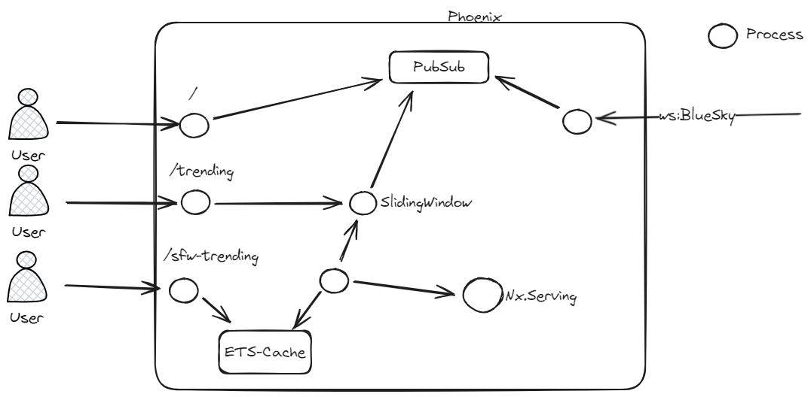

# TrendingHashtag

Really small example of a elixir based trending hashtag implementation:

Instead of relying on any dedicated infrastructure we use Phoenix, Phoenix PubSub and a simplistic sliding window implementation. 
As some tags might not be safe for work we utilize a huggingface model to predict if a tag is save "enough". 

## LiveViews:
- [localhost:4000](http://localhost:4000) => The stream of posts flowing into the system with a frequency
- [localhost:4000/trending](http://localhost:4000/trending) => The trending tags dashboard
- [localhost:4000/sfw-trending](http://localhost:4000/sfw-trending) => The trending dashboard with an indication if a tag is safe or unsafe

## Architecture:

The architecture is rather trivial:

On the root path a user directly subscribes to the PubSub topic that contains the posts.
On the /trending path each user calls the SlidingWindow GenServer.
On the /sfw-trending path every user calls the ets cache of the inferencing GenServer.

To start your Phoenix server:

  * Run `mix setup` to install and setup dependencies
  * Start Phoenix endpoint with `mix phx.server` or inside IEx with `iex -S mix phx.server`
  * You might need to start a postgres database (see [docker-compose](./docker-compose.yml))

Now you can visit [`localhost:4000`](http://localhost:4000) from your browser.

